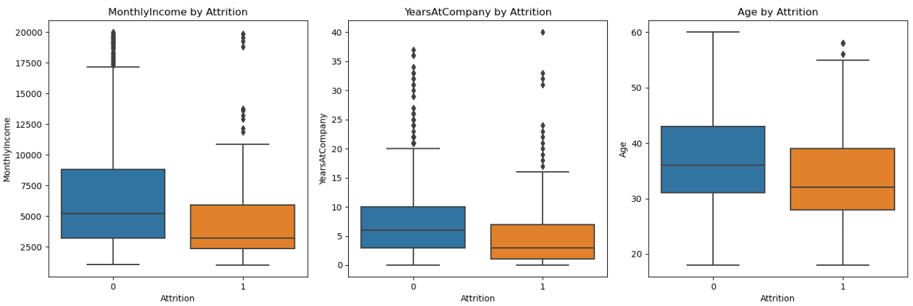
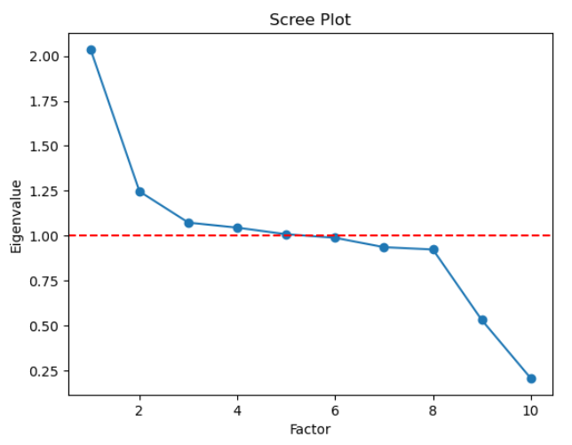
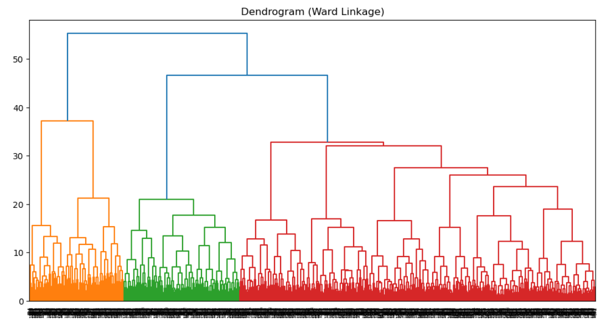
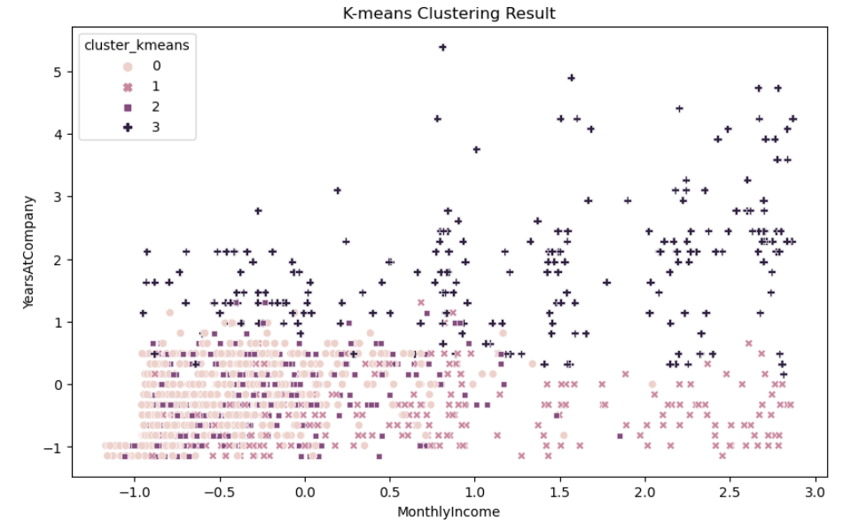
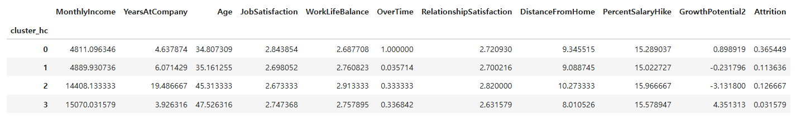
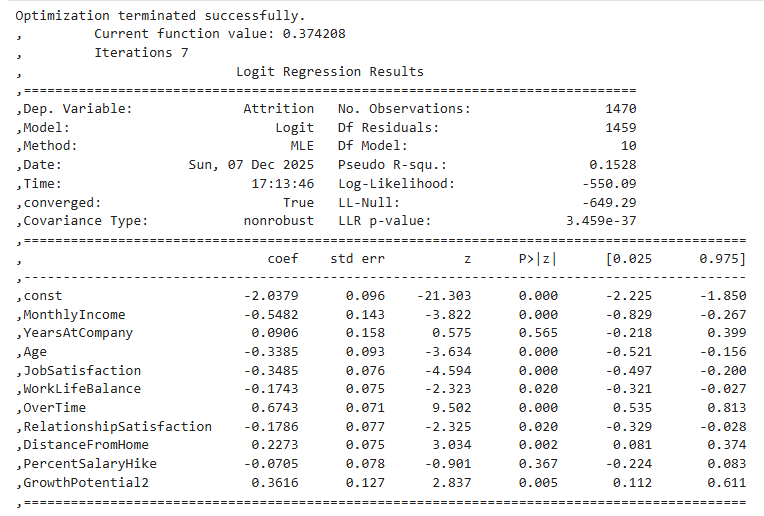
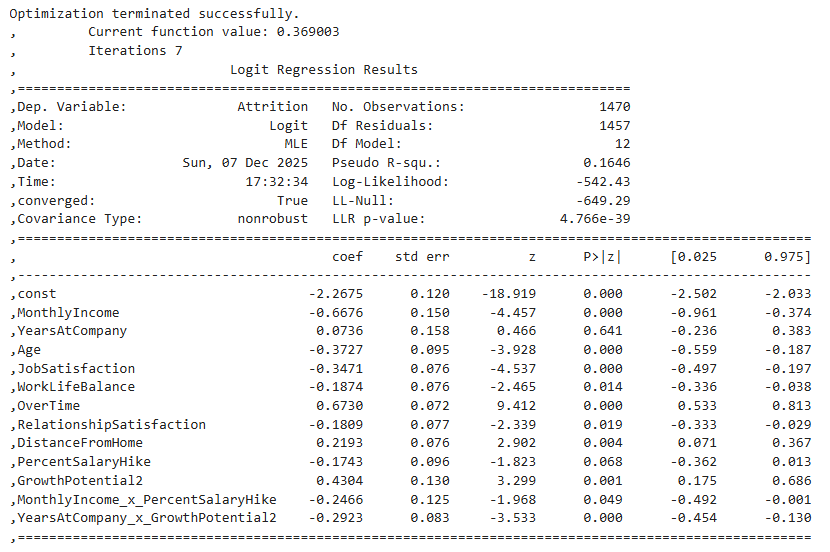

# 다변량 분석을 통한 "이직률 결정 요인" 탐구

> 이직률을 단일 지표가 아니라 **여러 정량 요인의 결합**으로 설명해 보는 다변량 분석 프로젝트

| | |
|---|---|
| **팀 구성** | 2인 구성, (팀장 담당) |
| **데이터** | IBM HR Analytics Employee Attrition & Performance (1,470명) |
| **사용 도구** | Python (pandas, scikit-learn, statsmodels, scipy, factor_analyzer, matplotlib, seaborn) |
| **자료** | [발표 자료(PDF)](docs/project_PPT.pdf) · [보충 자료(PDF)](docs/project_details.pdf) |


## 1. 문제 의식과 목표

기업의 이직률 상승이 이슈가 되고 있지만, 많은 기업이 **단일 지표**만으로 이직 원인을 판단합니다. 이렇게 보면 여러 요인이 함께 작용하는 실제 이직 구조를 놓치기 쉽습니다.

**목표: 이직을 설명하는 다양한 정량 요인을 통합적으로 분석하고, 이직 위험이 높은 집단의 특성을 찾는다.**

## 2. 데이터

- **출처**: IBM HR Analytics Employee Attrition & Performance (HR·직원 이직 분석에 쓰이는 공개 데이터셋)
- **규모**: 직원 1,470명
- **종속변수**: `Attrition` (이직 여부, 이직=1 / 잔류=0)
- 데이터 파일은 저장소에 포함하지 않았습니다. 

## 3. 분석 흐름

```
변수 선택 → 파생변수(GrowthPotential2) → EDA → 요인분석 → 군집분석 → 로지스틱 회귀 → 교호작용 추가
```

### 3-1. 변수 선택

변수를 4개 카테고리로 나눈 뒤, 이직과 관련이 클 것으로 판단한 10개 변수를 골랐습니다.

| 카테고리 | 변수 |
|---|---|
| 개인 특성 | `Age`, `YearsAtCompany`, `DistanceFromHome` |
| 직무 요인 | `OverTime`, `JobSatisfaction`, `WorkLifeBalance`, `YearsInCurrentRole` |
| 보상 요인 | `MonthlyIncome`, `PercentSalaryHike` |
| 조직 문화 | `RelationshipSatisfaction` |

이 중 `YearsInCurrentRole`은 아래 파생변수를 만드는 데 사용했고, 분석 모델에는 나머지 9개 변수와 파생변수 `GrowthPotential2`, 총 10개를 넣었습니다. `OverTime`은 Yes/No를 1/0으로 인코딩했고, 모든 독립변수는 표준화했습니다.

### 3-2. 파생변수 `GrowthPotential2`

기업 안에서의 성장 가능성을 보기 위해, 직급(`JobLevel`)별 평균 역할 근속기간에서 개인의 역할 근속기간을 뺀 간접 지표를 만들었습니다. 값이 클수록 같은 직급의 평균보다 현재 역할에 머문 기간이 짧다는 뜻입니다.

```python
joblevel_mean = df_original.groupby("JobLevel")["YearsInCurrentRole"].mean()
df_original["MeanYearsByJobLevel"] = df_original["JobLevel"].map(joblevel_mean)
df_original["GrowthPotential2"] = df_original["MeanYearsByJobLevel"] - df_original["YearsInCurrentRole"]
```

이 지표를 쓰려면 다음 세 가지 가정이 필요합니다.

1. 승진(직무 전환) 규칙이 일관적이다.
2. `JobLevel`의 정의가 안정적이다.
3. 승진 정책이 시간이 지나도 안정적이다.

*→ 최종 변수의 VIF 값을 검토하여 다중공선성 문제가 없음을 확인했습니다. 또한 산점도 & 상관관계 행렬을 확인해보았을 때 변수 간의 상관관계가 대부분 0.3 이하, 산점도 행렬에서도 변수 간 강한 선형 상관관계가 나타나지 않음을 확인했습니다.*

### 3-3. 탐색적 데이터 분석 (EDA)

이직 여부별로 각 변수의 분포를 박스플롯으로 비교했습니다. 이직자는 잔류자보다 월급, 근속연수, 나이가 전반적으로 낮았고, 직무 만족도도 낮은 편이었습니다. 초과근무(`OverTime`)는 이직자 쪽에서 뚜렷하게 높았습니다.



### 3-4. 요인분석

직접 나눈 4개 카테고리가 논리적으로 타당한지 확인하기 위해 요인분석(Factor Analysis)을 수행했습니다.



### 3-5. 군집분석

비슷한 특성을 가진 직원 집단을 찾기 위해 계층적 군집분석(Ward linkage)과 K-means를 사용했습니다. K-means의 군집 수는 Elbow Method와 실루엣 분석으로 검토해 **k=4**로 정했습니다.



[K-means 군집 산점도]


[군집별 평균 비교표]


군집별 평균을 비교해 해석한 결과입니다.

| 군집 | 특징 |
|---|---|
| 군집 1 | 젊고 저연봉이며 성장 가능성이 낮고 이직률이 높은 그룹 |
| 군집 2 | 고연령 중급자 그룹. 초과근무 비율이 높아 과로 위험이 있고 이직률은 중간 수준 |
| 군집 3 | 성장 가능성이 가장 높은 신입·초급 그룹. 이직률이 높음 |
| 군집 4 | 고연봉·고근속 핵심 인력. 이직률이 가장 낮은 안정적인 그룹 |

## 4. 모델링: 로지스틱 회귀

### 4-1. 기본 모델

10개 독립변수로 이직 여부를 설명하는 로지스틱 회귀를 적합했습니다. (Pseudo R² = 0.1528)



표준화한 변수 기준으로, 영향이 큰 변수는 다음과 같았습니다.

| 변수 | 해석 |
|---|---|
| `OverTime` | 초과근무를 하는 직원은 그렇지 않은 직원보다 이직 odds가 약 1.95배 |
| `MonthlyIncome` | 1 표준편차 증가 시 이직 odds 약 0.58배로 감소 |
| `Age` | 1 표준편차 증가 시 이직 odds 약 0.70배로 감소 |
| `JobSatisfaction` | 1 표준편차 증가 시 이직 odds 약 0.70배로 감소 |

그 밖에 `WorkLifeBalance`, `RelationshipSatisfaction`, `DistanceFromHome`, `GrowthPotential2`도 5% 수준에서 유의했습니다. `YearsAtCompany`와 `PercentSalaryHike`는 단독으로는 유의하지 않았습니다.

### 4-2. 교호작용항 추가

변수 하나씩의 효과로는 설명되지 않는 조합 효과를 보기 위해 교호작용항 4개를 추가해 검토했습니다. (Pseudo R² = 0.1646)

- `MonthlyIncome × PercentSalaryHike`
- `YearsAtCompany × GrowthPotential2`
- `JobSatisfaction × OverTime`
- `DistanceFromHome × WorkLifeBalance`



p-value를 확인해 **유의한 2개(`MonthlyIncome × PercentSalaryHike`, `YearsAtCompany × GrowthPotential2`)만** 최종 모델에 남겼습니다.


## 5. 결론

**이직은 '보상 × 성장성 × 근무환경'이 함께 작용한 결과로 설명된다.**

- **보상**: 급여가 높을수록 이직 확률이 낮았고, 급여와 인상률의 교호작용이 유의해 인상률의 효과가 급여 수준에 따라 달라졌습니다. 핵심 인재에게는 차등적인 보상·인상률 전략이 필요합니다.
- **성장성·경력**: 근속연수와 성장 지표(`GrowthPotential2`)의 교호작용이 유의했습니다. 팀은 이를 오래 근무했지만 성장이 정체된 직원이 이직 위험이 크다는 신호로 해석했고, 승진 속도 관리·직무 이동·경력개발 프로그램이 필요하다고 보았습니다.
- **직무·워라밸**: 직무 만족, 워라밸, 통근 거리가 이직과 연결되었습니다. 재택·하이브리드·배치 변경 같은 정책을 검토할 수 있습니다.
- **조직 문화**: 관계 만족이 낮을수록, 초과근무가 많을수록 이직 가능성이 높았습니다.

**핵심 이탈 위험군**: 성장 정체의 장기 근속자 / 과도한 초과근무자 / 젊고 만족도가 낮은 직원 / 장거리 출퇴근자 → 이들을 대상으로 한 맞춤형 이직 방지 전략이 필요합니다.

## 6. 폴더 구조

```
.
├── README.md
├── employee-attrition-analysis.ipynb # 이직률_결정_요인_탐구.ipynb
│   
├── docs/
│   ├── project_PPT.pdf
│   └── project_details.pdf
├── images/          # 시각화 자료
└── data/            # 데이터셋 (직접 내려받아 배치)
```

## 7. 역할

- 팀장, PPT 제작 및 분석 전 과정 공동 토의 , 교호작용항 아이디어 제안으로 모형 확장에 기여

## 8. 한계 및 개선 방향

- 로지스틱 회귀 기반의 **요인 해석**이 목적이며, 예측 성능(정확도, F1 등) 평가는 다루지 않았습니다.
- `GrowthPotential2`는 3-2의 세 가지 가정 아래에서 만든 간접 지표입니다.
- 사용한 데이터는 한 시점의 공개 데이터라 인과관계가 아닌 **연관성**을 해석한 것입니다.
