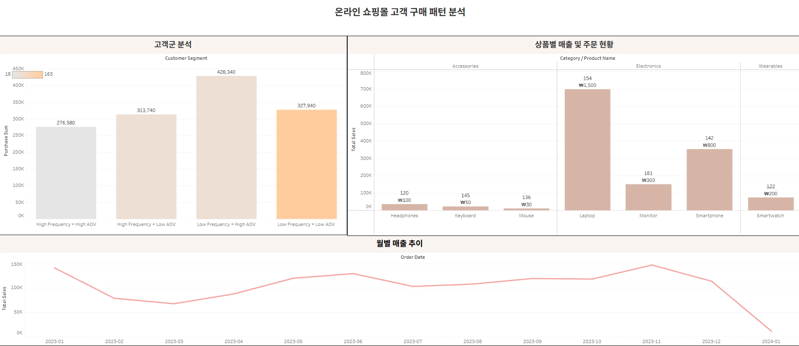

# 온라인 쇼핑몰 거래 데이터 분석 · 대시보드 구축

> 고객·상품·월별 데이터를 분석해 **매출에 기여하는 요인**을 찾고, 분석 결과를 **Tableau 대시보드**와 **실행 가능한 전략**으로 연결한 개인 프로젝트

<!-- TODO: 포트폴리오 5페이지의 Tableau 대시보드 이미지를 저장소에 올리고 경로를 맞추세요 -->


## 한눈에 보기

| 항목 | 내용 |
|---|---|
| 유형 | 개인 프로젝트 |
| 데이터 | 주문 1,000건 · 고객 292명 · 상품 7종(카테고리 3개) · 지역 4곳 <!-- TODO: 데이터 출처(예: Kaggle 링크) --> |
| 도구 | Python (pandas, numpy, matplotlib), Tableau |
| 핵심 질문 | 어떤 고객과 상품이 매출을 만드는가? |

## 핵심 결과

1. **데이터 품질 오류 20건 발견 및 보정**: `Unit Price × Quantity ≠ Total Price`인 행 20건을 찾아 Unit Price가 2배로 오기재된 오류로 규명하고, `Total Price ÷ Quantity` 파생변수로 보정
2. **'저빈도 · 고단가' 고객군의 총매출 기여도가 가장 높음**: 고객 수가 많은 '저빈도·저단가'보다, 자주 사지 않아도 한 번에 크게 쓰는 고객이 매출을 더 만들어 냄
3. **상품 단가가 매출 격차의 핵심**: Electronics와 Accessories는 고객 수·주문 건수가 비슷하지만 단가 차이(약 14.36배)로 매출 격차(약 16.6배)가 발생
4. **월별 매출은 뚜렷한 패턴이 없음**: 11월에 피크가 있으나 단기 데이터라 시계열 해석에는 한계가 있어, 세그먼트·상품 단가 구조에 분석을 집중

## 분석 과정

### 1. 데이터 점검
- 컬럼: 고객 ID, 성별, 지역, 나이, 상품명, 카테고리, 단가, 수량, 총 금액, 배송비, 배송 상태, 주문일
- 결측치(지역·나이·배송 상태)와 unique 값을 함께 점검하고, 한 상품에 여러 단가가 붙는 현상을 확인
- 배송비가 지역·카테고리·수량 등에 따라 달라지는지 탐색했으나 뚜렷한 차이는 없음

### 2. 데이터 품질 검증
```python
df['calcu'] = df['Unit Price'] * df['Quantity']
df['check'] = df['calcu'] == df['Total Price']
df['check'].value_counts()   # True 980 / False 20
```
- 불일치 20건을 단가 2배 오기재로 판단하고 `Final_unit_price = Total Price / Quantity`로 보정

### 3. 고객 단위 지표 설계
- 고객별 구매 횟수, 총 구매금액, 평균 주문금액, 구매 상품 종류를 집계한 `customer_df` 생성
- 평균과 중앙값 차이가 커서(총 구매금액 평균 4,611 / 중앙값 3,595) **고액 고객이 평균을 끌어올린다**고 판단, 평균만으로 고객을 설명하지 않고 중앙값을 함께 사용
- 구매 횟수와 평균 주문금액의 상관은 거의 0 → 자주 사는 고객이 한 번에 많이 쓰는 것은 아님

### 4. 고객 세분화 (구매빈도 × 평균주문금액)
구매 횟수와 평균 주문금액을 각각 **상위 25% 기준**으로 나눠 2×2 매트릭스로 4개 고객군을 정의

| 구분 | 고주문금액 | 저주문금액 |
|---|---|---|
| **고빈도** | 고객 수는 가장 적지만 1인당 구매금액·상품 다양성이 가장 높음 | 자주 구매하지만 객단가가 낮음 |
| **저빈도** | **총매출 기여도 가장 높음 (VIP)** | 고객 수 가장 많음 |

### 5. 상품·카테고리 분석
- 카테고리별 매출, 주문 건수, 평균 주문금액, 고객 수를 비교
- Electronics가 압도적인 매출을 차지하며, 매출은 주문 건수보다 **단가**에 좌우됨

### 6. 대시보드
- Tableau로 **고객군 · 상품별 · 월별 매출 추이**를 한 화면에 구성해 비개발자도 확인할 수 있는 환경 구축
<!-- TODO: Tableau Public 링크가 있다면 여기에 추가 -->

## 비즈니스 제안

| 구분 | 제안 |
|---|---|
| 고객별 | '저빈도·고단가' 고객: 재구매 주기 단축 (시즌 프로모션, 신제품 우선 안내, 개인화 큐레이션) |
| | '고빈도·저단가' 고객: 객단가 상승 (업셀링, 크로스셀링) |
| 상품별 | 고단가 상품(Laptop 등) 구매자: 추가 지출 저항이 낮아 크로스셀링에 적합 |
| | 저단가·다주문 상품(Mouse 등) 구매자: 재구매·구독형 판매 |
| 데이터 운영 | 입력 단계에 Unit Price × Quantity = Total Price **자동 검증 로직** 추가 |

## 한계와 다음 단계
- 제안한 전략을 실제로 검증할 기회가 없었고, 단기 데이터라 시계열 분석의 정확도가 낮음
- 이후 **A/B 테스트**로 제안의 효과를 검증해 보고 싶음

## 배운 점
- 평균 지표의 한계를 **세그먼트 분석**으로 보완
- 데이터를 그대로 믿지 않고 **직접 검증**하는 태도

## 폴더 구성
<!-- TODO: 실제 파일명에 맞게 수정하세요 -->
```
online-shopping-customer-analysis/
├── README.md
├── E_commerce_Analysis.ipynb    # 데이터 점검 · 품질 검증 · 고객/상품 분석
├── images/                      # 대시보드 스크린샷
└── data/                        # 재배포 가능한 경우에만 포함
```
